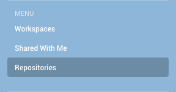

# Cours développement web avec Ruby on Rails

## Création d'un compte sur GitHub

Rendez-vous à cette URL [GitHub](https://github.com/), pour créer votre compte.

Une fois celui-ci, créé, merci de me communiquer votre identifiant GitHub à l'email benjamin+wbc@bhacklab.fr

## Création d'un compte Cloud9 IDE

Rendez-vous à cette URL [Cloud9 IDE](https://c9.io), pour créer votre compte. Vous devriez pouvoir créer un compte avec votre compte GitHub. Choisissez cette solution.

Une fois connecté à Cloud9, vous cliquez sur `Repositories` dans le menu.

Vous avez une liste de dépôts, qui sont lié à votre compte GitHub. Si vous n'avez rien, c'est que je n'ai pas eu votre compte GitHub pour vous rajouter au groupe.

Vous avez un dépôt `web-development-course` cliquez sur le bouton `Clone to edit`.

Voilà vous avez tout ce qu'il vous faut pour commencer le cours.

Bonne journée.

