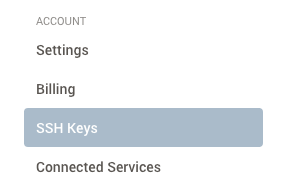
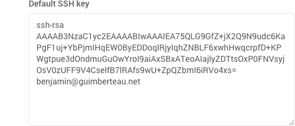
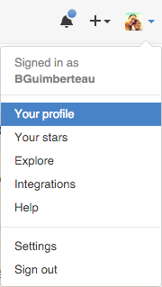
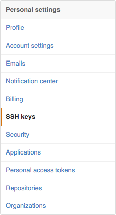

# Développement web avec Ruby on Rails

## Création d'un compte sur GitHub

Allez à cette URL [GitHub][GitHub], pour créer votre compte.

Une fois celui-ci, créé, merci de me communiquer votre identifiant GitHub à l'email benjamin+wdr@bhacklab.fr.

## Création d'un compte Cloud9

Allez à cette URL [Cloud9][Cloud9], pour créer votre compte. Vous devriez pouvoir créer un compte avec votre compte GitHub. Choisissez cette solution.

## Configuration de votre compte Cloud9

### Autoriser son compte GitHub depuis Cloud9

Allez dans vos préférences.

Cliquez sur `Connected Services` dans le menu.

La ligne correspondant à GitHub, cliquez sur `Connect` (vous devez être connecté à GitHub en parallèle) et suivez les instructions pour autoriser Cloud9 d'accéder à GitHub.

### Ajouter votre clé publique SSH de Cloud9 sur GitHub

Toujours dans les préférences Cloud9, cliquez sur `SSH Keys` depuis le menu.

Copiez le contenu du champs `Default SSH key` dans votre presse-papier (Windows / Linux : ctrl + c, Macintosh : cmd + c).

Allez sur [GitHub][GitHub].

Cliquez `Your profile` depuis le menu.

Cliquez sur `Edit profile`.

Cliquez sur `SSH keys` depuis le menu.

Cliquez sur `Add SSH key`.

Ajoutez Cloud9 IDE dans `Title` et collez votre clé SSH depuis le presse-papier (Windows / Linux : ctrl + v, Macintosh : cmd + v)

Maintenant votre compte Cloud9 peut cloner, pousser dans un dépôt GitHub.

## Création de votre espace de travail sur Cloud9

Cliquez sur `Repositories` depuis le menu.

Vous avez une liste de dépôts, qui sont liés à votre compte GitHub. Si vous n'avez rien, c'est que je n'ai pas eu votre compte GitHub pour vous rajouter au groupe.

Vous avez un dépôt `web-development-rails` cliquez sur le bouton `Clone to edit`.

Vous avez le logo de Cloud9, vous disant que votre espace de travail est en cours de création.

Voilà vous avez tous ce qu'il vous faut pour commencer le cours.

Bonne journée.

[Cloud9]: https://c9.io
[GitHub]: https://github.com/

